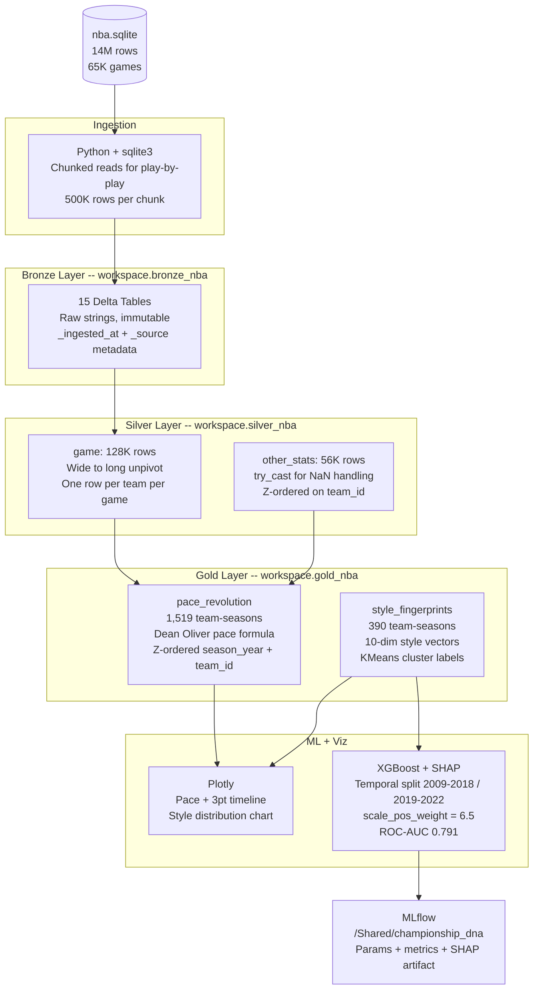

# Pace and Space

### How winning basketball changed -- and when

In 2009, 17 of 30 NBA teams played slow, defensive, grind-it-out basketball. By 2017, that number was zero. Something happened. This project figures out exactly what, when, and why -- and whether the teams that adopted it first actually won more.

Built on Databricks with PySpark and Delta Lake. 80 years of NBA data. Three questions, three answers.

---

## The Questions

**Did pace and three-point shooting actually change the game, or does it just feel that way?**
The Pace Revolution -- quantify exactly when tempo and 3pt rate shifted, year by year, team by team, from 1985 to 2022.

**Can you fingerprint how a team plays?**
Style Fingerprints -- cluster every team-season into a playing style using 10 measurable dimensions. No era labels. See if the model rediscovers history on its own.

**What actually predicts a championship run?**
Championship DNA -- train a model on regular season stats to predict conference finals appearances. Use SHAP to find which metrics actually matter vs which ones just feel important.

---

## What We Found

### The Pace Revolution
Three-point attempt rate grew **50% in nine years** -- from 0.26 in 2013 to 0.40 in 2021. The inflection point is unmistakable: the 2016 Warriors 73-win season. Before 2016, the trend was gradual. After 2016, the entire league moved at once.

The 1994 spike (when the NBA shortened the 3pt line) and the 1997 drop (when they moved it back) are both visible in the data without any labels -- the pipeline just shows you what happened.

### Style Fingerprints
KMeans clustering on 10 style dimensions with no era labels given. The model found six clusters and labeled them by their stat profiles:

| Cluster | Style | Avg Win % |
|---|---|---|
| Slow / Defensive / Grind | Low pace, paint dominant, isolation | 0.483 |
| Paint Dominant / Isolation | High FTA, low 3pt, physical | 0.450 |
| Balanced / Halfcourt | Middle of everything | 0.547 |
| Fast 3pt / Run and Gun | High pace + high 3pt rate | 0.453 |
| Warriors Style / Ball Movement | High pace + high assists + high 3pt | 0.543 |
| Analytics Optimized / Efficient | Selective 3pt, low turnovers, efficient | 0.552 |

What the model found without being told:

- 2009: 17 teams in "Slow/Defensive/Grind". Zero in Warriors Style or Analytics Optimized.
- 2017: "Slow/Defensive/Grind" hits zero and never comes back.
- 2018: 15 of 30 teams classified as "Warriors Style" -- peak copycat era.
- 2020 onward: league settles into two mature modern styles.

### Championship DNA
XGBoost predicting conference finals appearance from regular season stats. Trained on 2009-2018, tested on 2019-2022. ROC-AUC: **0.791**.

SHAP attribution on the test set:

- **Turnover rate** -- the strongest style predictor. Low turnovers push strongly toward championship contention. Playoff defense is tighter; teams that turn it over in the regular season get exposed.
- **Offensive rebounding** -- second chance points matter more in playoff series where every possession counts.
- **Three-point rate** -- surprisingly weak signal. Shoots a lot of 3s does not mean wins a championship.
- **Pace** -- near zero effect. Tempo alone predicts almost nothing about playoff success.
- **Win percentage** -- necessary but not sufficient. The model finds teams that overperform their style profile in the regular season and get exposed later.

The conventional wisdom says "shoot more 3s to win." The data says "take care of the ball."

---

## Architecture

---

## Tech Stack

> **Platform**
> Databricks Free Edition -- serverless notebooks, Unity Catalog storage, native MLflow

> **Data Processing**
> PySpark 4.1 -- medallion architecture, wide-to-long transforms, window functions, Z-ordering

> **Storage**
> Delta Lake on Unity Catalog -- ACID transactions, schema enforcement, time travel

> **Machine Learning**
> XGBoost + SHAP + scikit-learn -- classifier, explainability, temporal validation

> **Clustering**
> sklearn KMeans -- 10-dimension style vectors, StandardScaler, silhouette scoring

> **Visualization**
> Plotly -- interactive dual-axis timeline, stacked bar evolution chart

> **Experiment Tracking**
> MLflow (native Databricks) -- params, metrics, SHAP artifact, model registry

> **Package Management**
> uv -- fast, reproducible Python environments

---

## Key Design Decisions

Every decision below came up in building this. Each one has a reason.

**Why Delta Lake over plain Parquet?**
A 44-season backfill will fail partway through. With plain Parquet, a mid-write crash produces a partially written file -- wrong numbers with no error. Delta's atomicity means a failed write never appears. Seasons that completed are safe. Silver adds schema enforcement (rejects malformed rows). Gold uses time travel.

**Why PySpark throughout?**
The cluster is already running in Databricks serverless. Switching to Pandas mid-pipeline adds conversion overhead and two mental models in the same codebase. The 13.6M row play-by-play table is the architectural justification. Everything else rides along for free.

**Why Z-order over partitioning?**
Partitioning on `season_year` creates 44+ folders. On Databricks serverless, many small partitions degrade I/O performance. Z-ordering co-locates rows with similar `season_year` and `team_id` values within files -- queries filter on either dimension while avoiding the small file problem.

**Why not use play-by-play for analysis?**
All three analytical pillars are answerable from aggregated box score stats. The nba_api pre-computes pace, 3pt rate, and ratings at the team-game level. Play-by-play is ingested to Bronze and serves as the architectural justification for PySpark -- 13.6M rows is the number that makes "why not just use Pandas" a genuine question with a genuine answer.

**Why temporal train/test split?**
Stratified random split would leak future team style patterns into past predictions. A team's 2022 style fingerprint would inform predictions about 2015 playoff outcomes. Temporal split matches real deployment: train on history, predict the current season.

**Why scale_pos_weight over SMOTE?**
52 conference finalists out of 390 total team-seasons. scale_pos_weight = 338/52 = 6.5 tells XGBoost to weight positive examples 6.5x in gradient updates. SMOTE generates synthetic examples by interpolating between 52 real ones -- risky on a small sample where interpolated points may not represent real team profiles.

**Why conference finals, not championship?**
"Won championship" gives 1 positive per 30 teams per season -- too sparse. "Made playoffs" gives 16 of 30 -- too easy, model learns nothing. "Reached conference finals" gives 4 positives per season, is a meaningful basketball threshold (top 4 teams in the league), and yields 52 positive examples across 13 seasons.

---

## Data Source

Kaggle -- [NBA Database by wyattowalsh](https://www.kaggle.com/datasets/wyattowalsh/basketball)

- 65,000+ games since the 1946-47 season
- 13.6M rows of play-by-play
- Complete box scores, team stats, player info
- Single SQLite file, 2.35GB

---

## How to Run

**Prerequisites:** Databricks Free Edition account, Kaggle account to download the dataset.

1. Download `nba.sqlite` from the Kaggle link above
2. In Databricks: Catalog -> `workspace` -> `bronze_nba` -> Create volume `raw_files` -> Upload file (fits the 5GB UI limit)
3. Import notebooks from the `notebooks/` folder into your Databricks workspace
4. Run in order -- each notebook reads from the previous layer's Delta tables

| Notebook | What it does |
|---|---|
| `00_environment_test` | Verifies PySpark, Delta Lake, Unity Catalog write access |
| `01_bronze_ingestion` | Reads SQLite, writes 15 Delta tables to `bronze_nba` |
| `02_silver_game` | Unpivots game table wide-to-long, casts types, filters season types |
| `03_gold` | Pace formula, style fingerprints, KMeans clustering, XGBoost, MLflow |
| `04_pace_viz` | Plotly dual-axis timeline, style distribution chart |

MLflow results visible at `/Shared/championship_dna` in your workspace after running `03_gold`.

---

## Resume Bullets

**Data Engineering**
Built Pace and Space, an NBA analytics pipeline on Databricks -- PySpark 4.1 processing 14M rows through Delta Lake medallion architecture (Bronze/Silver/Gold), Z-ordered by season and team for query optimization, with MLflow experiment tracking and Unity Catalog storage

**Data Science**
Engineered Championship DNA model predicting NBA playoff success from regular season metrics -- XGBoost classifier with temporal train/test split and scale_pos_weight for class imbalance (ROC-AUC 0.791), SHAP attribution identifying turnover rate and offensive rebounding as dominant predictors over pace and three-point rate; KMeans clustering on 10-dimension style vectors detected the Warriors revolution without era labels
